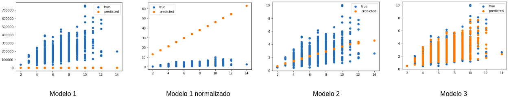

## Taller de predicción de precios mediante modelos de regresión

Machine Learning, TensorFlow, Regresión Lineal Simple, Regresión Lineal Múltiple, Neural Networks, Keras. 

## Ejercicio 4 - Creación de un una regresión lineal simple y múltiple mediante redes de neuronas

El objetivo de este ejercicio es construir un modelo de regresión lineal mediante la utilización de una red de neuronas. 

**Paso 1: Instación de paquetes**

Los cuadernos (notebooks) son entidades independientes que permiten la utilización de cualquier tipo de páquete python y para ellos nos ofrece la posibilidad de instalar paquete mediante la utilización de la sistema de instalación de paquetes pip. Para la instalación de los diferentes paquetes que utilizaremos para la realización de nuestro paquetes tenemos que ejecutar el siguiente comando:

```
!pip install pandas scikit-learn numpy seaborn matplotlib tensorflow h5py keras
```

Como podemos observar, es necesario incluir el caracter __!__ antes del comando de instalación. A continuación hay que seleccionar el fragmento y pulsar la tecla play para ejecutar el código contenido en el fragmento. Siendo el resultado de la ejecución de esta linea, el siguiente:

```
Requirement already satisfied: pandas in /usr/local/lib/python3.6/dist-packages (1.0.5)
Requirement already satisfied: scikit-learn in /usr/local/lib/python3.6/dist-packages (0.22.2.post1)
Requirement already satisfied: numpy in /usr/local/lib/python3.6/dist-packages (1.18.5)
Requirement already satisfied: seaborn in /usr/local/lib/python3.6/dist-packages (0.10.1)
Requirement already satisfied: matplotlib in /usr/local/lib/python3.6/dist-packages (3.2.2)
Requirement already satisfied: tensorflow in /usr/local/lib/python3.6/dist-packages (2.2.0)
Requirement already satisfied: h5py in /usr/local/lib/python3.6/dist-packages (2.10.0)
Requirement already satisfied: keras in /usr/local/lib/python3.6/dist-packages (2.3.1)
Requirement already satisfied: python-dateutil>=2.6.1 in /usr/local/lib/python3.6/dist-packages (from pandas) (2.8.1)
Requirement already satisfied: pytz>=2017.2 in /usr/local/lib/python3.6/dist-packages (from pandas) (2018.9)
Requirement already satisfied: joblib>=0.11 in /usr/local/lib/python3.6/dist-packages (from scikit-learn) (0.15.1)
Requirement already satisfied: scipy>=0.17.0 in /usr/local/lib/python3.6/dist-packages (from scikit-learn) (1.4.1)
Requirement already satisfied: pyparsing!=2.0.4,!=2.1.2,!=2.1.6,>=2.0.1 in /usr/local/lib/python3.6/dist-packages (from matplotlib) (2.4.7)
Requirement already satisfied: cycler>=0.10 in /usr/local/lib/python3.6/dist-packages (from matplotlib) (0.10.0)
Requirement already satisfied: kiwisolver>=1.0.1 in /usr/local/lib/python3.6/dist-packages (from matplotlib) (1.2.0)
Requirement already satisfied: absl-py>=0.7.0 in /usr/local/lib/python3.6/dist-packages (from tensorflow) (0.9.0)
Requirement already satisfied: wrapt>=1.11.1 in /usr/local/lib/python3.6/dist-packages (from tensorflow) (1.12.1)
Requirement already satisfied: termcolor>=1.1.0 in /usr/local/lib/python3.6/dist-packages (from tensorflow) (1.1.0)
Requirement already satisfied: six>=1.12.0 in /usr/local/lib/python3.6/dist-packages (from tensorflow) (1.12.0)
Requirement already satisfied: wheel>=0.26; python_version >= "3" in /usr/local/lib/python3.6/dist-packages (from tensorflow) (0.34.2)
Requirement already satisfied: google-pasta>=0.1.8 in /usr/local/lib/python3.6/dist-packages (from tensorflow) (0.2.0)
Requirement already satisfied: tensorboard<2.3.0,>=2.2.0 in /usr/local/lib/python3.6/dist-packages (from tensorflow) (2.2.2)
Requirement already satisfied: protobuf>=3.8.0 in /usr/local/lib/python3.6/dist-packages (from tensorflow) (3.10.0)
Requirement already satisfied: gast==0.3.3 in /usr/local/lib/python3.6/dist-packages (from tensorflow) (0.3.3)
Requirement already satisfied: opt-einsum>=2.3.2 in /usr/local/lib/python3.6/dist-packages (from tensorflow) (3.2.1)
Requirement already satisfied: astunparse==1.6.3 in /usr/local/lib/python3.6/dist-packages (from tensorflow) (1.6.3)
Requirement already satisfied: keras-preprocessing>=1.1.0 in /usr/local/lib/python3.6/dist-packages (from tensorflow) (1.1.2)
Requirement already satisfied: tensorflow-estimator<2.3.0,>=2.2.0 in /usr/local/lib/python3.6/dist-packages (from tensorflow) (2.2.0)
Requirement already satisfied: grpcio>=1.8.6 in /usr/local/lib/python3.6/dist-packages (from tensorflow) (1.30.0)
Requirement already satisfied: keras-applications>=1.0.6 in /usr/local/lib/python3.6/dist-packages (from keras) (1.0.8)
Requirement already satisfied: pyyaml in /usr/local/lib/python3.6/dist-packages (from keras) (3.13)
Requirement already satisfied: setuptools>=41.0.0 in /usr/local/lib/python3.6/dist-packages (from tensorboard<2.3.0,>=2.2.0->tensorflow) (47.3.1)
Requirement already satisfied: google-auth-oauthlib<0.5,>=0.4.1 in /usr/local/lib/python3.6/dist-packages (from tensorboard<2.3.0,>=2.2.0->tensorflow) (0.4.1)
Requirement already satisfied: google-auth<2,>=1.6.3 in /usr/local/lib/python3.6/dist-packages (from tensorboard<2.3.0,>=2.2.0->tensorflow) (1.17.2)
Requirement already satisfied: tensorboard-plugin-wit>=1.6.0 in /usr/local/lib/python3.6/dist-packages (from tensorboard<2.3.0,>=2.2.0->tensorflow) (1.6.0.post3)
Requirement already satisfied: markdown>=2.6.8 in /usr/local/lib/python3.6/dist-packages (from tensorboard<2.3.0,>=2.2.0->tensorflow) (3.2.2)
Requirement already satisfied: requests<3,>=2.21.0 in /usr/local/lib/python3.6/dist-packages (from tensorboard<2.3.0,>=2.2.0->tensorflow) (2.23.0)
Requirement already satisfied: werkzeug>=0.11.15 in /usr/local/lib/python3.6/dist-packages (from tensorboard<2.3.0,>=2.2.0->tensorflow) (1.0.1)
Requirement already satisfied: requests-oauthlib>=0.7.0 in /usr/local/lib/python3.6/dist-packages (from google-auth-oauthlib<0.5,>=0.4.1->tensorboard<2.3.0,>=2.2.0->tensorflow) (1.3.0)
Requirement already satisfied: pyasn1-modules>=0.2.1 in /usr/local/lib/python3.6/dist-packages (from google-auth<2,>=1.6.3->tensorboard<2.3.0,>=2.2.0->tensorflow) (0.2.8)
Requirement already satisfied: cachetools<5.0,>=2.0.0 in /usr/local/lib/python3.6/dist-packages (from google-auth<2,>=1.6.3->tensorboard<2.3.0,>=2.2.0->tensorflow) (4.1.0)
Requirement already satisfied: rsa<5,>=3.1.4; python_version >= "3" in /usr/local/lib/python3.6/dist-packages (from google-auth<2,>=1.6.3->tensorboard<2.3.0,>=2.2.0->tensorflow) (4.6)
Requirement already satisfied: importlib-metadata; python_version < "3.8" in /usr/local/lib/python3.6/dist-packages (from markdown>=2.6.8->tensorboard<2.3.0,>=2.2.0->tensorflow) (1.6.1)
Requirement already satisfied: idna<3,>=2.5 in /usr/local/lib/python3.6/dist-packages (from requests<3,>=2.21.0->tensorboard<2.3.0,>=2.2.0->tensorflow) (2.9)
Requirement already satisfied: urllib3!=1.25.0,!=1.25.1,<1.26,>=1.21.1 in /usr/local/lib/python3.6/dist-packages (from requests<3,>=2.21.0->tensorboard<2.3.0,>=2.2.0->tensorflow) (1.24.3)
Requirement already satisfied: chardet<4,>=3.0.2 in /usr/local/lib/python3.6/dist-packages (from requests<3,>=2.21.0->tensorboard<2.3.0,>=2.2.0->tensorflow) (3.0.4)
Requirement already satisfied: certifi>=2017.4.17 in /usr/local/lib/python3.6/dist-packages (from requests<3,>=2.21.0->tensorboard<2.3.0,>=2.2.0->tensorflow) (2020.6.20)
Requirement already satisfied: oauthlib>=3.0.0 in /usr/local/lib/python3.6/dist-packages (from requests-oauthlib>=0.7.0->google-auth-oauthlib<0.5,>=0.4.1->tensorboard<2.3.0,>=2.2.0->tensorflow) (3.1.0)
Requirement already satisfied: pyasn1<0.5.0,>=0.4.6 in /usr/local/lib/python3.6/dist-packages (from pyasn1-modules>=0.2.1->google-auth<2,>=1.6.3->tensorboard<2.3.0,>=2.2.0->tensorflow) (0.4.8)
Requirement already satisfied: zipp>=0.5 in /usr/local/lib/python3.6/dist-packages (from importlib-metadata; python_version < "3.8"->markdown>=2.6.8->tensorboard<2.3.0,>=2.2.0->tensorflow) (3.1.0)
```

En este caso no se ha realizado la instalación de ningún paquete debido a que todos ya estaban instalados en Collaborate. 

Además vamos a incluir un comando que permite cargar la extensión de TensorFlow Board dentro de los cuadernos de tipo Jupyter, de forma que se despligue de manera embebida en el entorno. 

```
%load_ext tensorboard
```

**Paso 2: Despliegue de librerías**

Para la realización de este ejercicio tenemos que importar nuevas librerías relacionadas con keras. Para ello es necesario modificar los paquetes importados que vamos a utilizar con respecto al ejercicio anterior. 

```
import os
import random
import zipfile
import pandas as pd
import numpy as np
import tensorflow as tf
import datetime
import matplotlib.pyplot as plt

from os import getcwd
from sklearn.model_selection import cross_val_score
from sklearn.model_selection import KFold

from tensorflow import keras
from time import time

from keras.callbacks import TensorBoard
from keras.models import Sequential
from keras.layers import Dense, Flatten, Dropout
from keras import optimizers
from keras.utils import plot_model
from keras.models import model_from_json

```

Para el desarrollo de los diferentes ejercicios vamos a necesitar un conjunto de liberías que servirán para lo siguiente:

* numpy: Nos ofrece funciones para la manipulación de arrays y conjunto de datos. 
* matplotlib: Nos ofrece funciones para la visualización de datos. 
* tensorflow: Nos ofrece funciones para la construacción de procesos de entrenamiento.
* random: Nos ofrece funciones para la generación de números aleatorios.
* zipfile: Nos ofrece funciones para la manipulación de archivos comprimidos.
* pandas: Nos ofrece funciones para la manipulación de los datos.en o
* os: Nos ofrece funciones para la manipulación de recursos del sistema operativo. 
* os.path: Nos ofrece funciones para la manipulación del sistema de ficheros del sistema operativo.
* requests: Nos ofrece funciones para la descarga de archivos.
* math: Nos ofrece funciones para la realización de operaciones matemáticas complejos (no elementales).
* time: Nos ofrece funciones para la obtención de information referente al tiempo, para crear contadores o archivos de log. 
* Keras.model: Nos permite utilizar diferentes tipo de modelos, en este caso vamos a utilizar el modelo secuencial. 
* Keras.layers: Nos permite utilizar diferentes tipo de capas para incluir en una red de neuronas.
* optimizers from keras: Nos permite utilizar diferentes tipos de algoritmos de optimización, en nuestro caso utilizaremos el optimizador de Adams. 
* Keras.utils: Nos ofrece diferentes funciones para obtener información de la red construida. 
* TensorBoard: Nos ofrece diferentes funciones para cargar información en tensorborad y poder visualizar la evoluación de nuestros algoritmos. 


**Paso 3: Descarga de datos**

A continuación vamos a realizar la descarga de los datos. Para el desarrollo de este ejercicio vamos a utilizar los datos del dataset sobre [precios de vivienda de Kaggle](https://www.kaggle.com/c/neolen-house-price-prediction). 

En primer lugar deberemos crear un directorio, que denominaremos data, para almacenar y manipular la información que utilizaremos para la realización del ejercicio. Para ello deberemos incluir el siguiente fragmento de código:

```
data_path = 'data'

try:
  os.makedirs(data_path, mode=0o777, exist_ok=False)
except OSError:
    print ("El directorio %s no hay podido ser creado o ya existe." % (data_path))
else:
    print ("El directorio %s ha sido creado correctamente." % (data_path))
```

Una vez hayamos creado el directorio __data__ podemos proceder a descargar el archivo comprimido donde se encuentra toda la información necesaria para el desarrollo de este tutorial mediante el siguiente fragmento de código:

```
!wget --no-check-certificate \
    https://github.com/momartinm/linear_regression_tf/raw/master/data/neolen-house-price-prediction-kaggle.zip \
    -O /content/data/neolen-house-price-prediction-kaggle.zip
```

Al igual que en el paso 1 hemos utilizado un comando para la descarga de los datos, por ese motivo hemos tenido que incluir el caracter especial !.

**Paso 4 - Descompresión y carga de archivos**

Una vez que hemos descargado correctamente nuestro datos, podremos descomprimir el archivo con el objetivo de utilizar los diferentes archivos que contiene. Para ello deberemos utilizar el siguiente fragmento de código:

local_zip = '/content/data/neolen-house-price-prediction-kaggle.zip'

```
try:
  zip_ref = zipfile.ZipFile(local_zip, 'r')
  zip_ref.extractall(data_path)
  zip_ref.close()
except:
    print ("El archivo no ha podido ser descomprimido." % (local_zip))
```

**Paso 5 - Preparación de los conjuntos de datos**

Una vez que hemos descomprimido el archivo que descargamos previamente podremos comenzar a trabajar con los datos. Tras el proceso de descompresión tendremos tres ficheros de datos:

* data_description.txt: Fichero con información referente a cada uno atributos (features) de las instancias. 
* train.csv (entrenamiento/validacion): Conjunto de ejemplos de información para los procesos de entrenamiento y validación.
* test.csv (test): Conjunto de ejemplos de información para los procesos de test.

Para poder trabajar con estos conjuntos de datos vamos a utilizar la librería Pandas que importamos previamente. Mediante esta librería podemos transformar/cargar los datos contenidos en un archivo csv a un DataFrame. Los DataFrame son conjuntos de series de datos sobre los que se pueden realizar ciertos proceso de transformación. Para poder cargar los datos deberemos utilizar el siguiente fragmento de código:

```
file_train = os.path.join(getcwd(), data_path, 'train.csv')
file_test = os.path.join(getcwd(), data_path, 'test.csv')

data_train = pd.read_csv(file_train)
data_test = pd.read_csv(file_test)
```
Una vez que hemos cargado los mediante la función __read_csv__ los podemos inspeccionar mediante las funciones _head_ o __tail__ que nos permiten visualizar un conjunto de elementos del comienzo o el final del fichero respectivamente (por defecto se muestrarán 5 instancias. Además podemos visualizar los tamaños de ambos conjuntos mediante la propiedad __shape__. 

```
print(data_train.head())
print(data_train.shape)
```

Una vez que hemos analizado los datos que tenemos en nuestros conjuntos de entrenamiento y test podemos crear los conjuntos reales que vamos a utilizar. Como estamos trabajando con una regresión lineal simple sólo tendremos un valor en X y un valor en Y. Es decir, sólo tendremos una feature para cada una de nuestras instancias y entrenamiento y una etiqueta. Para este ejemplo vamos a crear tres conjuntos de datos de entrenamiento con diferentes features:

* Conjunto 1: media del número de habitaciones por planta (TotRmsAbvGrd)
* Conjunto 2: media del número de habitaciones por planta (TotRmsAbvGrd), Mes de venta (MoSold) y el año de venta (YrSold).
* Conjunto 3: 13 atributos entre los que se incluyen la media del número de habitaciones por planta (TotRmsAbvGrd), Mes de venta (MoSold) y el año de venta (YrSold).

```
features_train_set_1 = data_train[['TotRmsAbvGrd']]
features_train_set_2 = data_train[['TotRmsAbvGrd', 'MoSold', 'YrSold']]
features_train_set_3 = data_train[['TotRmsAbvGrd', 'MoSold', 'YrSold', 'OverallQual', 'OverallCond', 'YearBuilt', 'YearRemodAdd', '1stFlrSF', '2ndFlrSF', 'FullBath', 'HalfBath', 'BedroomAbvGr', 'KitchenAbvGr']]
```

A continuación vamos a normalizar aquellos con el objetivo que todos tengan valores en el mismo rango entre 0 y 1 para facilitar el proceso de aprendizaje para la red de neuronas. Para ellos utilizaremos la función __max__ que ofrece Pandas, que calcula el valor máximo de una columna (serie). 

```
features_train_set_1['TotRmsAbvGrd'] = pd.to_numeric(features_train_set_1['TotRmsAbvGrd'], downcast='float')

features_train_set_2['TotRmsAbvGrd'] = pd.to_numeric(features_train_set_2['TotRmsAbvGrd'], downcast='float') / features_train_set_2['TotRmsAbvGrd'].max()
features_train_set_2['MoSold'] = pd.to_numeric(features_train_set_2['MoSold'], downcast='float') / features_train_set_2['MoSold'].max()
features_train_set_2['YrSold'] = pd.to_numeric(features_train_set_2['YrSold'], downcast='float') / features_train_set_2['YrSold'].max()

features_train_set_3['TotRmsAbvGrd'] = pd.to_numeric(features_train_set_3['TotRmsAbvGrd'], downcast='float') / features_train_set_3['TotRmsAbvGrd'].max()
features_train_set_3['MoSold'] = pd.to_numeric(features_train_set_3['MoSold'], downcast='float') / features_train_set_3['MoSold'].max()
features_train_set_3['YrSold'] = pd.to_numeric(features_train_set_3['YrSold'], downcast='float') / features_train_set_3['YrSold'].max()
features_train_set_3['OverallQual'] = pd.to_numeric(features_train_set_3['OverallQual'], downcast='float') / features_train_set_3['OverallQual'].max()
features_train_set_3['OverallCond'] = pd.to_numeric(features_train_set_3['OverallCond'], downcast='float') / features_train_set_3['OverallCond'].max()
features_train_set_3['YearBuilt'] = pd.to_numeric(features_train_set_3['YearBuilt'], downcast='float') / features_train_set_3['YearBuilt'].max()
features_train_set_3['YearRemodAdd'] = pd.to_numeric(features_train_set_3['YearRemodAdd'], downcast='float') / features_train_set_3['YearRemodAdd'].max()
features_train_set_3['1stFlrSF'] = pd.to_numeric(features_train_set_3['1stFlrSF'], downcast='float') / features_train_set_3['1stFlrSF'].max()
features_train_set_3['2ndFlrSF'] = pd.to_numeric(features_train_set_3['2ndFlrSF'], downcast='float') / features_train_set_3['2ndFlrSF'].max()
features_train_set_3['FullBath'] = pd.to_numeric(features_train_set_3['FullBath'], downcast='float') / features_train_set_3['FullBath'].max()
features_train_set_3['HalfBath'] = pd.to_numeric(features_train_set_3['HalfBath'], downcast='float') / features_train_set_3['HalfBath'].max()
features_train_set_3['BedroomAbvGr'] = pd.to_numeric(features_train_set_3['BedroomAbvGr'], downcast='float') / features_train_set_3['BedroomAbvGr'].max()
features_train_set_3['KitchenAbvGr'] = pd.to_numeric(features_train_set_3['KitchenAbvGr'], downcast='float') / features_train_set_3['KitchenAbvGr'].max()
```

Además de construir diferentes conjuntos de características vamos a crear dos conjuntos de etiquetas (labels). Uno sin normalizar y otro normalizado en valores entre 0 y 10. 

```
labels_train = data_train['SalePrice']
labels_train_norm = data_train['SalePrice'] / data_train['SalePrice'].max() * 10
```

**Paso 6. Generación de la red**

Una vez definadas la variables de entrada y salida con su formato (shape) podemos construir nuestra red de neuronas que estará compuesta de capas de tipo Fully Connected (Dense). Esta es la capa básica de una red de neuronas convencionales donde cada neurona de la capa está conectada con todas las neuronas de la capa anterior, de este modelo de conexión proviene su nombre __fully connected__. 

Para este ejercicio vamos a crear una red de neuronas para nuestro primer conjunto de valores. Esta red estará formada por una sóla capa con el fin de encontrar una relación lineal entre el número de habitaciones y el valor de la vivienda. 

```
net_1 = Sequential(name='Linear Regresion simple')
net_1.add(Dense(units=1, input_dim=1))
```

**Paso 7. Definición de función de optimización**

A continuación tenemos que definir la función de obtimización que utilizaremos para minimizar el valor de función de coste. Para este ejecicio vamos a utilizar el algoritmo de [Adam](https://arxiv.org/abs/1412.6980https://arxiv.org/abs/1412.6980) con el fin de minimizar el coste del error mediante la función __optimizers.Adam__. 

```
optimizer_fn = optimizers.Adam(learning_rate=0.002, beta_1=0.9, beta_2=0.999)
```

**Paso 8. Compilación de la red**

A continuación debemos compilar nuestra redes utilizando un algoritmo de optimización y una función de loss, que en este caso utilizaremos la función que calcula el error cuadrático medio. 

```
net_1.compile(optimizer=optimizer_fn, loss='mean_squared_error')
net_1.summary()
```

Además una vez compilada la red, utilizaremos la función __summary__ que nos presenta un resumen de la estructura de la red que hemos creado (capas, orden de las capas, variables a entrenar, etc). 

**Paso 9. Definición de bucle de entrenamiento (Función)**

Una vez que se han definido todas las variables y funciones necesarias para el proceso de aprendizaje, podemos crear la función de entrenamiento. En este caso la función es muy sencilla y formada por tres parámetros:

- net que se corresponde con la red secuencial que hemos definido previamente.
- X que se corresponde con la características (features) de los ejemplos.
- Y que se corresponde con las etiquetas (labels) de los ejemplos.
- training_iters que se corresponde con el número de iteraciones del proceso de entrenamiento.
- batch_size que se corresponde con el tamaño de los conjuntos de entrenamiento que se utilizarán. 
- validation_split que se corresponde con el tamaño del cojunto de validación. Es decir, el conjunto de entrada (x_shaped_array) se divirá en dos conjunto: (1) el conjunto de entrenamiento que contendrá el 90% de los ejemplos; y (2) el conjunto de validación que contendrá el 10% de los ejemplos. El primero ser utilizada para cada iteración de entrenamiento, mientras que el segundo será utilizado para validar el modelo después de cada iteración. 

Esta función realiza una reestructuración de los datos de los conjuntos de entrenamiento y test para ajustarlos al formato y tamaño de las imágenes que hemos definido en caso de que existe alguna discrepancia y ejecuta el proceso de entrenamiento mediante la utilización del método __fit__ que ejecuta un proceso similar al que definimos en el ejercicio anterior. Además en este caso incluimos un __callback__ con el objeto de recolectar información que nos permita visualizar la evolución del proceso de entrenamiento mediante TensorBoard. 

```
def train(net, X, Y, training_iters, batch_size = 10, validation_split=0.1):
  
  tf.compat.v1.reset_default_graph()
   
  logdir = "./logs/scalars/" + datetime.datetime.now().strftime("%Y%m%d-%H%M%S") 
  tensorboard_callback = TensorBoard(log_dir=logdir)
  
  net.fit(
    X, 
    Y,
    batch_size=batch_size,
    epochs=training_iters,
    validation_split=validation_split,
    callbacks=[tensorboard_callback])
  
  return net
```

Además tras el proceso de entrenamiento podemos calcular el resultado de nuestro modelo sobre el conjunto de test con el objetivo de conocer la capacidad real de nuestro modelo. Para ello utilizaremos la función __evaluate__ que como como parámetros obligatorios son el conjunto de características (x_test_shaped_array) y el de etiquetas (test_y). Además vamos a incluir el mismo tamaño de bacth que utilizamos en el proceso de entrenamiento. 

**Paso 10 - Visualización de la recta de regresión para los conjuntos de entrenamiento y test**

Una vez que hemos cargado el modelo podemos realizar la inferencia sobre el modelo mediante la función __predict__ que nos permite predecir el valor de salida mediante un valor de entrada. Para comprobar el funcionamiento del modelo de predicción vamos a construir un función que genera una gráfica que nos muestra la regresión lineal obtenida. 

```
def print_regression_line(model, X_print, X, Y):

  plt.scatter(X_print, Y, label="true")
  plt.scatter(X_print, model.predict(X).flatten(), label="predicted")
  plt.legend(['true', 'predicted'])
  plt.show()
```

**Paso 11. Ejecución del proceso de entrenamiento**

Una vez construidas nuestras funciones podemos ejecutar nuestro proceso de aprendizaje de la siguiente manera, ejecutando el proceso de aprendizaje durante 100 iteraciones con una tasa de aprendizaje del 0.001 y un tamaño de batch de 100 instancias. 

```
model_1 = train(net_1, features_train_set_1, labels_train, 100, 100)
print_regression_line(model_1, features_train_set_1, features_train_set_1, labels_train)
```

También podemos entrenar la red utilizando los valores de salida (labels) normalizados de la siguiente manera:

```
model_1_norm = train(net_1, features_train_set_1, labels_train_norm, 100, 100)
print_regression_line(model_1_norm, features_train_set_1, features_train_set_1, labels_train_norm)
```

**Paso 12. Visualización de los resultados con TensorFlowBoard**

Es posible visualizar la información mediante TensorFlow Board con el objetivo de poder obtener toda la información sobre el proceso de aprendizaje. Para ello es necesario incluir el siguiente comando y ejercutar el fragmento del cuarderno. TensorBoard utilizar los ficheros de logs que se han generado en el fichero que indiquemos como valor del parámetro __logdir__, que en este caso se corresponde con la carpeta logs que hemos utilizado para almacenzar los logs generados en el función de entrenamiento del paso 9. 

```
%tensorboard --logdir logs
```

Tras la ejecución podremos ver a través del interfaz web, embevida en nuestro cuaderno, el resultado de nuestro proceso de aprendizaje, como se muestra en la siguiente imagen:


Si ejecutamos este comando antes del proceso de aprendizaje podremos ver en tiempo real la evolución del proceso, ya que TensorBoard tiene un sistema de refresco de 30 segundos. 


**Paso 13. Entrenando otros modelos**

Una vez que hemos entrenado nuestra primer red de neuronas podremos construir nuevas redes de neuronas utilizando más variables de entrada o modificando los diferentes hiperparámetros. La siguiente red estará formada por tres capas (entrada, oculta y salida), ya que entre caso nuestro conjunto de entrada está formado por tres atributos. 

```
net_2 = Sequential(name='Linear Regresion Multiple 3')
net_2.add(Dense(units=3, input_dim=3))
net_2.add(Dense(units=9, activation='relu'))
net_2.add(Dense(units=1))

net_2.compile(optimizer=optimizer_fn, loss='mean_squared_error')
net_2.summary()

model_2 = train(net_2, features_train_set_2, labels_train_norm, 200, 750)
print_regression_line(model_2, features_train_set_1, features_train_set_2, labels_train_norm)
```

La tercerá red estará compuesta por 5 capas (entrada, 3x oculta y salida) con el objetivo de encontrar entre todas la variables de entrada que en este caso son 13. 

```
net_3 = Sequential(name='Linear Regresion multiple 13')
net_3.add(Dense(units=13, input_dim=13))
net_3.add(Dense(units=39, activation='relu'))
net_3.add(Dense(units=117, activation='relu'))
net_3.add(Dense(units=39, activation='relu'))
net_3.add(Dense(units=1, kernel_initializer='normal'))

net_3.compile(optimizer=optimizer_fn, loss='mean_squared_error')
net_3.summary()

model_3 = train(net_3, features_train_set_3, labels_train_norm, 200, 750)
print_regression_line(model_3, features_train_set_1, features_train_set_3, labels_train_norm)
```

A continuación se presentan los modelos de regresión obtenidos de los procesos de entrenamiento anteriores



**Paso 14: Almacenamiento de nuestro modelo**

Una vez que hemos construido nuestro modelo, podemos almacenarlo con dos objetivos: (1) utilizar para realizar inferencia sobre nuevos datos; y (2) cargarlo para seguir aprendiendo en el futuro con un nuevo conjunto de datos. Para ello es necesario almacenar la información del modelo mediante dos ficheros:

* Fichero de tipo json que almacena la estructura de la red que hemos construido.
* Fichero de tipo h5 que almacena la información de los pesos de las neuronas de nuestro red. 

Para poder generaro estos dos ficheros debemos utilizar el siguiente fragmento de código:

```
model_folder = "models"

try:
    os.mkdir(model_folder)
except OSError:
    print ("El directorio %s no hay podido ser creado" % (model_folder))
else:
    print ("El directorio %s ha sido creado correctamente" % (model_folder))


model_path = './models/'
model_name = 'model'

model_json = model.to_json()

with open(model_path + model_name + '.json', "w") as json_file:
    json_file.write(model_json)

model.save_weights(model_path + model_name + ".h5")
```

Tras la ejecución de este fragmento de código habremos generado nuestro los dos ficheros que describen la estructua de nuestra red de neuronas y los valos de los pesos de las diferentes capas. 

**Paso 15 - Carga del modelo previamente guardado**

Una vez que hemos almacenado nuestro modelo, podemos cargarlo con el objetivo de poder ejecutar el proceso de inferencia en la aplicación en la cual queremos desplegar el modelo. Para ello tendremos que cargar el modelo que hemos almacenado previamente mediante el siguiente fragmento de código.

```
json_file = open(model_path + model_name + '.json', 'r')

loaded_model_json = json_file.read()
json_file.close()

loaded_model = model_from_json(loaded_model_json)
loaded_model.load_weights(model_path + model_name + '.h5')
```

**Congratulations Ninja!**

Has aprendido como construir un modelo de regresión mediante Machine Learning utilizando TensorFlow 2.0 y Keras. Has conseguido aprender:

1. Como desplegar TensorBoard en un entorno Notebook.
2. Como definir los conjuntos de entrenamiento y test.
3. Como crear una variable de tipo Variable en TensorFlow. 
4. Como construir una red mediante Keras.
5. Como definir la función de optimización. 
6. Como construir el bucle de entrenamiento. 
7. Como visualizar datos referentes al proceso de entrenamiento mediante TensorBoard. 
8. Como guardar un modelo para poder utilizarlo en el futuro.
9. Como cargar un modelo previamente guardado y realizar una predicción. 


